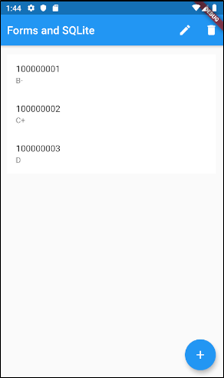
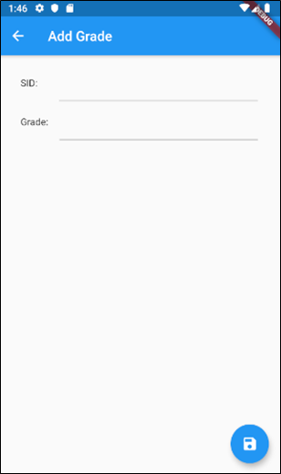

# Lab 05/06
The starter code for lab 05-06.

## Overview
Let's develop a simple grade entry system (UI and back-end) in Flutter.

_**Note:** This lab is designed to take 2 weeks, and will be worth the value of two lab assignments.  It is recommended that you do the overall user interface in the first week, and have placeholder data handlers (e.g. that just print to the console).  You can implement these functions in the second week._
 
## Instructions
### User Interface
Our user interface will be relatively simple.  We'll have two pages.  The first page, `ListGrades`, will show a list of all available grades.  The second page, `GradeForm`, will allow entry of grade data.  Below are two screenshots of the resulting UI:

 
_Figure 1 - The `ListGrades` page_

_Figure 2 - The `GradeForm` page_

First, you will need to create a Grade class that will store the following information:
- `sid` - A `String` containing the 9-digit student ID
- `grade` - A `String` containing the letter grade for that student

#### ListGrades
The `ListGrades` page will use a `ListView` to show all grades entered into the system.  For now, you can use a list of placeholder data, but be sure to enter enough grades to test scrolling.  The `ListView` elements will be `ListTile` widgets.  The `title` of the `ListTile` will be the `sid`, and the `subtitle` will be the `grade`.  The `ListGrades` page will also show two actions on the app bar:

- `Edit` (using the icon `Icons.edit`) - calls the method `_editGrade()`
- `Delete` (using the icon `Icons.delete`) - calls the method `_deleteGrade()`

The `ListGrades` page will also show a floating action button (using the icon `Icons.add`), which will call the method `_addGrade()`.

For now, both the `_addGrade()` method and the `_editGrade()` method will merely show the `GradeForm` page, and print a message to the console to help you ensure that they execute.

In order to edit or delete a grade, we'll need the ability to select one.  We'll do this by adding a variable `_selectedIndex`, which will get set when the list item is tapped.  This can easily be done by wrapping the `ListTile` in a `GestureDetector`, and implementing the `onTap` handler.  For the `ListTile` that is selected, show it with a blue background.  You can do this by wrapping the `ListTile` in a `Container`, and giving it a `BoxDecoration` as its decoration.  `BoxDecoration` has a `color` attribute.   The selected grade will not impact the add grade functionality.

#### GradeForm
The `GradeForm` page will show a form, consisting of two text fields (one for `sid`, and one for `grade`), and a floating action button (`Save`, with icon `Icons.save`).

### Implementing Persistence using SQLite
Our job for this part will be to:

- [ ] populate the `ListGrades` page with data from the database, and
- [ ] implement the `_addGrade()` method and the `_editGrade()` method.  

The actual logic will go into a separate class, `GradesModel`.  You can use the _SQFlite_ demo code as a starting point, if it makes it easier.

You will need to add an id field, as well as the following functions in the `Grade` class:
- `toMap()`
    - Returns a map of all three fields of the `Grade` class (`id`, `sid`, and `grade`)
- `fromMap()`
    - Generates a new `Grade` instance using a map containing all three fields of the `Grade` class (`id`, `sid`, and `grade`)

You will need to implement the following functions in the `GradesModel` class:
- `getAllGrades()`
    - Returns a list of all grades in the database
- `insertGrade(Grade grade)`
    - Adds a new grade to the database, using the data included in `grade`
    - Returns the newly generated id
- `updateGrade(Grade grade)`
    - Updates the grade in the database with `id` equal to that of `grade`, using the new data included in grade
- `deleteGradeById(int id)`
    - Deletes the grade in the database with the provided `id`

Using the `getAllGrades()` function in `GradesModel`, provide real data to the `ListGrades` page.

Now, we can implement the stubbed functions:
- `_addGrade()`
    - Show the `GradeForm` page, and use the returned `Grade` object (if not `null`) to call `insertGrade` in the `GradesModel`
- `_editGrade()`
    - Show the `GradeForm` page, and use the returned `Grade` object (if not `null`) to call `updateGrade` in the `GradesModel`
- `_deleteGrade()`
    - For the selected `Grade`, use its `id` to call `deleteGradeById` in the `GradesModel`

### Need Extra Challenge?
Add the ability to delete grades using the swiping gesture.  Add the ability to edit grades using the long press gesture, with a popup menu if able.

## Getting Help
If you run into difficulty, you may wish to check out some of the following resources:

- https://api.flutter.dev/  - The standard documentation for Flutter, all classes and methods.
- https://dart.dev/tutorials - A series of tutorials for the Dart programming language, focusing entirely on the features of Dart.
- https://flutter.dev/docs/reference/tutorials - A series of tutorials for the Flutter platform, focusing mainly on the widgets and API.
- https://flutter.dev/docs/codelabs - A series of deep-dive, more comprehensive, tutorials to learn more about the Flutter platform.
- https://flutter.dev/docs/cookbook - A set of recipes for commonly used features of Flutter.
- https://github.com/flutter/samples/blob/master/INDEX.md - A repository containing some completed Flutter applications.
- http://stackoverflow.com/ - A forum for asking questions about programming.  I bet you know this one already!

Of course, you can always ask the TA for help!  However, learning how to find the answers out for yourself is not only more satisfying, but results in greater learning as well.

## How to Submit
Create your flutter project inside this folder, commit, and then push your code to this repository to submit your lab assignment.